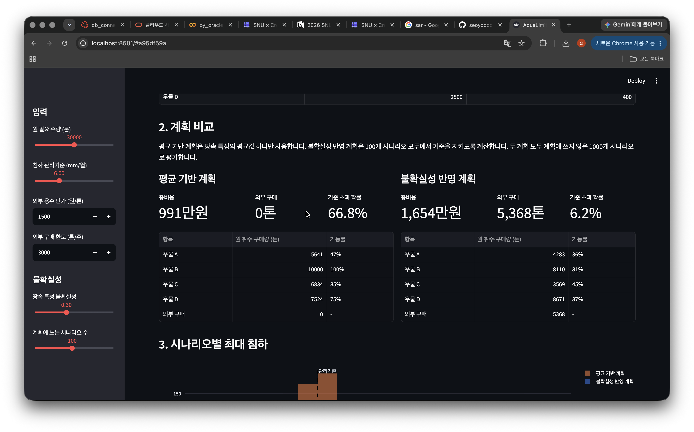
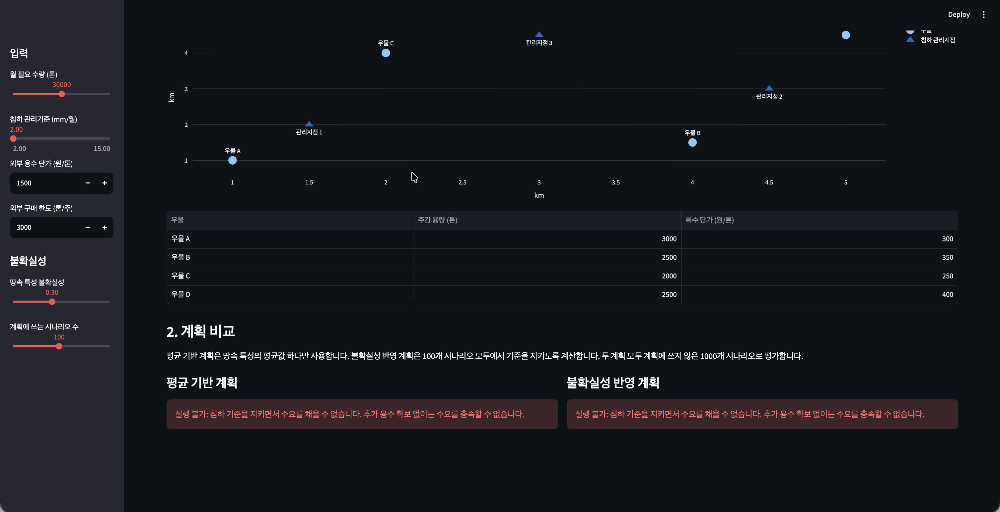
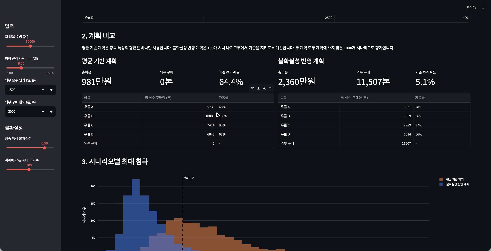
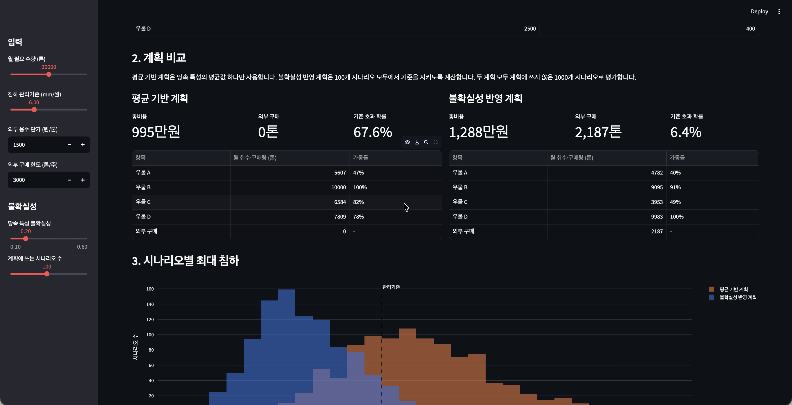

# AquaLimit

> 땅이 꺼지지 않게 하면서 필요한 물을 확보하려면, 어느 우물에서 얼마나 물을 뽑아야 하는지 위성 자료로 계산하는 서비스.

## 1. 문제 — 지하수를 뽑으면 땅이 꺼진다

- 땅속 지하수층의 물을 너무 많이 뽑으면 지반이 가라앉는다.
- 점토층 같은 일부 지층은 한번 눌리면 물이 다시 차도 원래대로 돌아오지 않는다. 영구적인 피해다.
- 침하는 수로·배관·건물을 손상시킨다. 캘리포니아 수자원국은 침하로 수로의 통수 능력이 줄고 에너지·유지보수 비용이 늘어난다고 설명하며, 2021년 침하로 잃은 수송 능력 복구를 위해 1억 달러 규모 지원사업을 시작했다.

물 공급 사업자:

| 선택 | 결과 |
|---|---|
| 물을 덜 뽑는다 | 부족한 물을 외부에서 비싸게 구매 |
| 계속 뽑는다 | 지반침하, 시설 손상 |

## 2. 위성의 역할 — 땅이 몇 mm 꺼졌는지 본다

- 레이더 위성(Sentinel-1)은 같은 지역을 며칠 간격으로 반복 촬영한다.
- 두 시점의 레이더 신호를 비교하면 지표가 mm 단위로 얼마나 움직였는지 알 수 있다. (InSAR)
- 위성이 땅속 물을 직접 보는 것은 아니다. 지표가 얼마나 꺼졌는지를 보고, 땅속에서 일어난 일을 거꾸로 추정한다.

## 3. 서비스가 하는 일

| 단계 | 내용 | 
|---|---|
| ① 땅속 상태 파악 | 위성 침하 자료 + 우물 수위 기록 + 지질 자료로 지층이 얼마나 잘 눌리는지 추정 | 
| ② 미래 시뮬레이션 | “1번 우물을 줄이고 3번을 늘리면?”을 지하수 물리모델로 계산, AI 대리모델로 빠르게 반복 |
| ③ 최적 계획 추천 | 땅속 상태의 여러 가능성을 모두 고려해, 어느 경우에도 기준을 지키면서 비용이 가장 낮은 계획 산출 | 

## 4. 사용 예시

입력: “다음 달 물 3만 톤 필요, 침하는 월 6mm 이하로 관리”

출력 예시:

| 항목 | 결과 |
|---|---|
| 우물별 취수량 | 우물 A 주 2,000톤, 우물 B 주 500톤 … |
| 외부 구매량 | 1만 톤 |
| 예상 침하 | 3~5mm (여러 가능성의 범위) |
| 총비용 | 취수 비용 + 구매 비용 |
| 추가 계측 권고 | 자료가 부족한 구역 표시 |

조건을 만족하는 계획이 없으면 억지로 답을 만들지 않고 “추가 용수 확보 없이는 수요를 충족할 수 없다”고 알려준다.

※ 수치는 설명용 예시다.

## 5. 기존 것과의 차이

**관련 연구**

| 연구 | 한 것 |
|---|---|
| Pang 외, 2022, 중국 항저우 평원 | 지하수·침하 모델로 침하 제약 아래 우물군 취수량 최적화 |
| Tuo 외, 2026, 중국 신장 창지 | Sentinel-1 InSAR로 지하수·침하 모델 보정, 취수 20~80% 감축 시나리오 비교 |

**AquaLimit의 차이**

| 기존 연구 | AquaLimit |
|---|---|
| 한 번 보정한 모델로 분석 | 새 위성 관측이 들어올 때마다 모델 갱신 |
| 평균 모델 하나로 계산 | 땅속 불확실성을 반영한 강건 계획 |
| 일괄 감축 시나리오 비교 | 우물별 최적 배분 + 비용 + 실행 불가 판정 |
| 1회성 연구 | 사업자가 반복해서 쓰는 운영 도구 |

## 6. 효과 증명 — 네 가지 방식 비교

| 방식 | 사용 자료 |
|---|---|
| ① 기존 운영 | 현재 취수 방식 그대로 |
| ② 지상 자료 최적화 | 우물 수위만 |
| ③ 위성 추가 최적화 | 우물 수위 + 위성 침하 |
| ④ 위성 + 불확실성 최적화 | ③ + 여러 가능성 반영 |

같은 수요·조건에서 공급 부족량, 총비용, 기준 초과 빈도, 계산 시간을 비교한다.

- ② vs ③: 위성을 넣으면 무엇이 좋아지는가
- ③ vs ④: 불확실성을 반영해야 하는 이유

## 7. 가상 데이터 데모

③ 최적 계획 단계를 가상 데이터로 먼저 만들었다. 가상 우물 4개와 침하 관리지점 3개, 땅속 상태의 가능성 100가지를 두고 비용이 가장 적은 취수 계획을 계산한다. 평가는 계획에 쓰지 않은 1,000가지 가능성으로 한다.

### 구현

`가상 지역·시나리오 생성 → 최적 계획 계산 → 1,000개 시나리오로 평가 → 화면`

| 기술 | 사용한 곳 |
|---|---|
| NumPy | 침하 관계·불확실성 시나리오 생성, 1,000개 시나리오 일괄 평가 |
| SciPy | 선형계획으로 비용 최소 계획 계산, 실행 불가 판정 |
| pandas · Plotly | 결과 표, 지도·침하 분포 그래프 |
| Streamlit | 웹 화면 |

**최적화:** 수요·우물 용량·침하 기준을 지키면서 총비용 최소화. 불확실성 반영 계획은 100개 시나리오 모두에서 침하 기준을 지키도록 계산.

### 화면 1 — 평균만 믿은 계획 vs 불확실성 반영 계획

- 평균만 믿은 계획: 991만원, 침하 기준 초과 확률 66.8%
- 불확실성 반영 계획: 1,654만원, 초과 확률 6.2%
- “평균만 믿으면 3번 중 2번 땅이 기준보다 더 꺼진다. 비용을 더 들이면 위험을 6%로 낮출 수 있다.”

### 화면 2 — 불가능하면 불가능하다고 알려준다

- 침하 기준을 2mm로 강화하면 두 계획 모두 “추가 용수 확보 없이는 수요를 충족할 수 없습니다”를 표시한다.
- “억지로 그럴듯한 답을 만들지 않는다.”

### 화면 3·4 — 땅속을 잘 알수록 같은 안전을 더 싸게 얻는다

| 위성 없이 땅속을 잘 모를 때 (불확실성 0.5) | 위성으로 땅속을 보정했을 때 (불확실성 0.2) |
|---|---|
|  |  |

| 땅속 불확실성 | 불확실성 반영 계획 비용 | 기준 초과 확률 |
|---|---|---|
| 0.5 (위성 없음 가정) | 2,360만원 | 5.1% |
| 0.2 (위성 보정 가정) | 1,288만원 | 6.4% |

- 위험은 비슷하게 유지하면서 비용이 약 1,070만원(45%) 줄어든다.
- “위성으로 땅속 상태를 더 정확히 알면, 같은 안전을 훨씬 적은 비용으로 확보할 수 있다. 이것이 위성을 쓰는 이유다.”
- ※ 0.5와 0.2는 위성 자료 유무를 가정한 값이다. 실제 감소 폭은 다음 단계에서 위성 자료로 확인한다.

## 8. 다음 주 계획

데모의 가상 침하 관계를 **물리모델**로 바꾸고, **실제 위성 침하 자료**를 확보한다.

| 작업 | 내용 | 결과물 |
|---|---|---|
| InSAR 자료 확보 | Sentinel-1 레이더 위성의 반복 촬영으로 mm 단위 침하 측정. 공개 처리 자료 확인 후 불러오기 | 실제 지역 침하 지도 |
| 물리모델 구축 | MODFLOW 6(USGS 지하수 시뮬레이터) + 침하 패키지로 가상 대수층 구성 | 취수에 따른 수위·침하 결과 |
