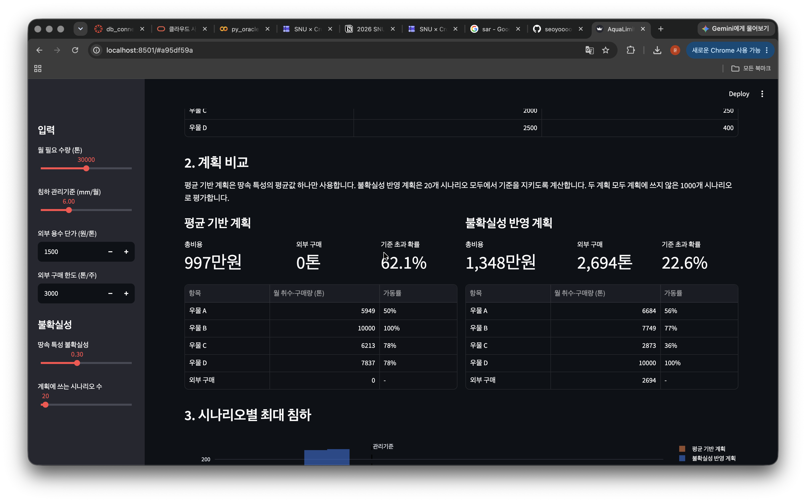

# AquaLimit

> 땅이 꺼지지 않게 하면서 필요한 물을 확보하려면, 어느 우물에서 얼마나 물을 뽑아야 하는지 위성 자료로 계산하는 서비스.

## 1. 문제 — 지하수를 뽑으면 땅이 꺼진다

- 땅속 지하수층의 물을 너무 많이 뽑으면 지반이 가라앉는다.
- 점토층 같은 일부 지층은 한번 눌리면 물이 다시 차도 원래대로 돌아오지 않는다. 영구적인 피해다.
- 침하는 수로·배관·건물을 손상시킨다. 캘리포니아 수자원국은 침하로 수로의 통수 능력이 줄고 에너지·유지보수 비용이 늘어난다고 설명하며, 2021년 침하로 잃은 수송 능력 복구를 위해 1억 달러 규모 지원사업을 시작했다.

물 공급 사업자:

| 선택 | 결과 |
|---|---|
| 물을 덜 뽑는다 | 부족한 물을 외부에서 비싸게 구매 |
| 계속 뽑는다 | 지반침하, 시설 손상 |

## 2. 위성의 역할 — 땅이 몇 mm 꺼졌는지 본다

- 레이더 위성(Sentinel-1)은 같은 지역을 며칠 간격으로 반복 촬영한다.
- 두 시점의 레이더 신호를 비교하면 지표가 mm 단위로 얼마나 움직였는지 알 수 있다. 이 기술이 InSAR다.
- 위성이 땅속 물을 직접 보는 것은 아니다. 지표가 얼마나 꺼졌는지를 보고, 땅속에서 일어난 일을 거꾸로 추정한다.

## 3. 서비스가 하는 일

| 단계 | 내용 | 비유 |
|---|---|---|
| ① 땅속 상태 파악 | 위성 침하 자료 + 우물 수위 기록 + 지질 자료로 지층이 얼마나 잘 눌리는지 추정 | 체중 변화로 식단을 추정 |
| ② 미래 시뮬레이션 | “1번 우물을 줄이고 3번을 늘리면?”을 지하수 물리모델로 계산, AI 대리모델로 빠르게 반복 | 일기예보 시뮬레이션 |
| ③ 최적 계획 추천 | 땅속 상태의 여러 가능성을 모두 고려해, 어느 경우에도 기준을 지키면서 비용이 가장 낮은 계획 산출 | 최악의 날씨까지 고려한 여행 계획 |

## 4. 사용 예시

입력: “다음 달 물 10만 톤 필요, 침하는 월 5mm 이하로 관리”

출력 예시:

| 항목 | 결과 |
|---|---|
| 우물별 취수량 | 우물 A 주 2,000톤, 우물 B 주 500톤 … |
| 외부 구매량 | 1만 톤 |
| 예상 침하 | 3~5mm (여러 가능성의 범위) |
| 총비용 | 취수 비용 + 구매 비용 |
| 추가 계측 권고 | 자료가 부족한 구역 표시 |

조건을 만족하는 계획이 없으면 억지로 답을 만들지 않고 “추가 용수 확보 없이는 수요를 충족할 수 없다”고 알려준다.

※ 수치는 설명용 예시다.

## 5. 기존 것과의 차이

| 이미 있는 것 | AquaLimit |
|---|---|
| 위성 침하 관측 서비스: “땅이 꺼지고 있다”까지 | “그래서 우물을 이렇게 운영하라”는 결정까지 연결 |
| 지하수·침하 시뮬레이터 | 새 위성 관측이 들어올 때마다 모델 갱신 |
| 침하 제약 취수 최적화 연구 | 관측·모델의 불확실성을 반영한 계획과 비용 비교를 반복 제공 |

침하를 고려한 취수 최적화는 이미 연구된 주제다. 차별점은 위성 기반 갱신, 불확실성 처리, 운영 제품화에 있다.

## 6. 효과 증명 — 네 가지 방식 비교

| 방식 | 사용 자료 |
|---|---|
| ① 기존 운영 | 현재 취수 방식 그대로 |
| ② 지상 자료 최적화 | 우물 수위만 |
| ③ 위성 추가 최적화 | 우물 수위 + 위성 침하 |
| ④ 위성 + 불확실성 최적화 | ③ + 여러 가능성 반영 |

같은 수요·조건에서 공급 부족량, 총비용, 기준 초과 빈도, 계산 시간을 비교한다.

- ② vs ③: 위성을 넣으면 무엇이 좋아지는가
- ③ vs ④: 불확실성을 반영해야 하는 이유

## 7. 가상 데이터 데모

③ 최적 계획 단계를 가상 데이터로 먼저 만들었다. 가상 우물 4개와 침하 관리지점 3개, 땅속 상태의 가능성 100가지를 두고 비용이 가장 적은 취수 계획을 계산한다. 평가는 계획에 쓰지 않은 1,000가지 가능성으로 한다.

Tools: Python, NumPy, SciPy(선형계획), pandas, Plotly, Streamlit

### 화면 1 — 평균만 믿은 계획 vs 불확실성 반영 계획

- 평균만 믿은 계획: 991만원, 침하 기준 초과 확률 66.8%
- 불확실성 반영 계획: 1,654만원, 초과 확률 6.2%
- “평균만 믿으면 3번 중 2번 땅이 기준보다 더 꺼진다. 비용을 더 들이면 위험을 6%로 낮출 수 있다.”

### 화면 2 — 불가능하면 불가능하다고 알려준다

- 침하 기준을 2mm로 강화하면 두 계획 모두 “추가 용수 확보 없이는 수요를 충족할 수 없습니다”를 표시한다.
- “억지로 그럴듯한 답을 만들지 않는다.”

### 화면 3 — 고려하는 가능성이 적으면 덜 안전하다

- 계획에 쓰는 가능성을 100개에서 20개로 줄이면 불확실성 반영 계획의 초과 확률이 6.2%에서 22.6%로 오른다.
- “땅속 상태를 얼마나 잘 파악하느냐가 안전을 좌우한다. 그래서 위성으로 땅속 상태를 추정하는 단계가 필요하다.”

## 8. 다음 주 계획

1. 검증 지역 확정: 후보 지역별 위성 침하·우물 수위·지질·취수 기록 확보 가능 여부 정리
2. 실제 위성 자료 확보: Sentinel-1 촬영 목록 검색, 공개 InSAR 침하 자료를 지도에 표시
3. 가상 관계를 물리모델로 교체: 지하수 물리모델(MODFLOW 6 + 침하 패키지)로 가상 대수층을 만들고, 데모의 침하 관계를 모델 계산값으로 교체
4. 고객 조사: 지하수 침하를 관리해야 하는 사업자·기관과 현재 관리 방식 조사

## 예상 질문

**데모 결과를 실제 효과로 볼 수 있나요?**
아닙니다. 불확실성을 반영하는 방식이 어떤 차이를 만드는지 보여주는 가상 실험입니다. 실제 효과는 검증 지역의 자료와 물리모델로 다시 확인합니다.

**한국에도 이런 문제가 있나요?**
조사 중입니다. 공개 자료가 많은 캘리포니아에서 먼저 검증하고, 국내·해외 적용 가능성은 별도로 확인합니다.

**비슷한 연구가 이미 있지 않나요?**
침하 제약 취수 최적화 연구는 있습니다. 위성 관측으로 모델을 계속 갱신하고, 불확실성을 반영한 운영 계획으로 만드는 것이 차별점입니다.

**우물별 취수 기록이 없으면요?**
가상 시나리오로 최적화를 검증하고, 실제 운영 개선으로는 표현하지 않습니다.

**누가 돈을 내나요?**
여러 우물을 운영하는 수도사업자·공업용수 사업자입니다. 지역 모델 구축비와 연간 이용료 구조를 가정하고 있으며, 가격은 검증 전입니다.
