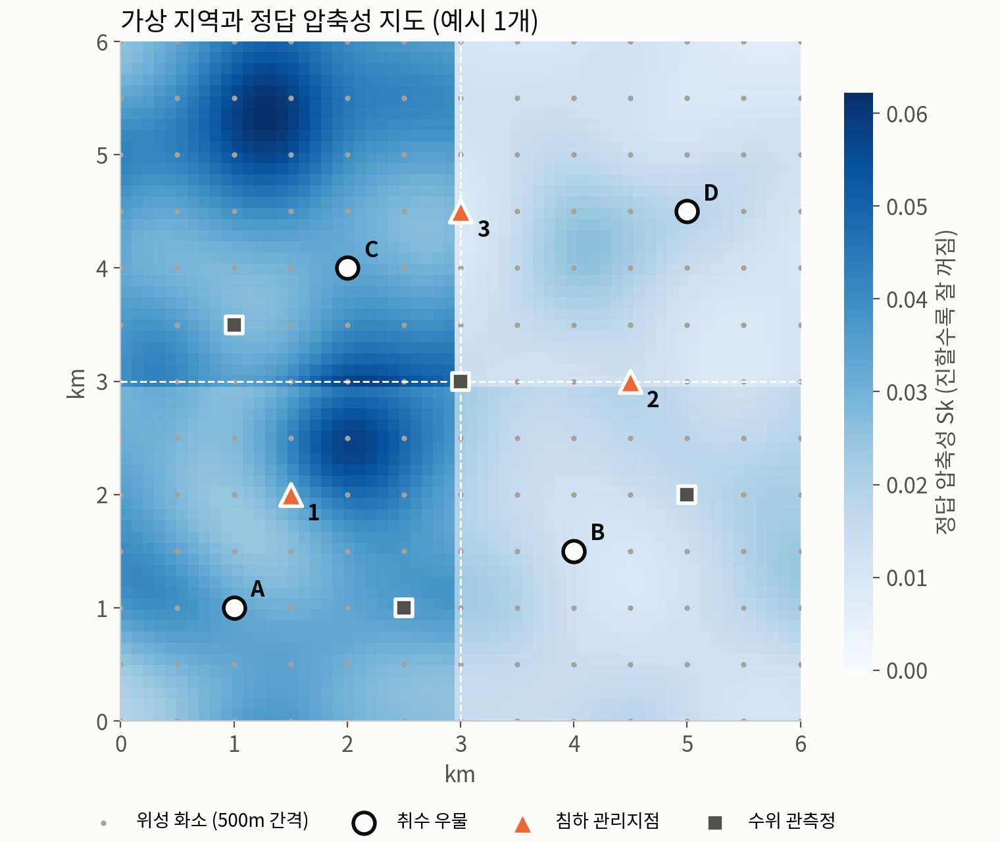
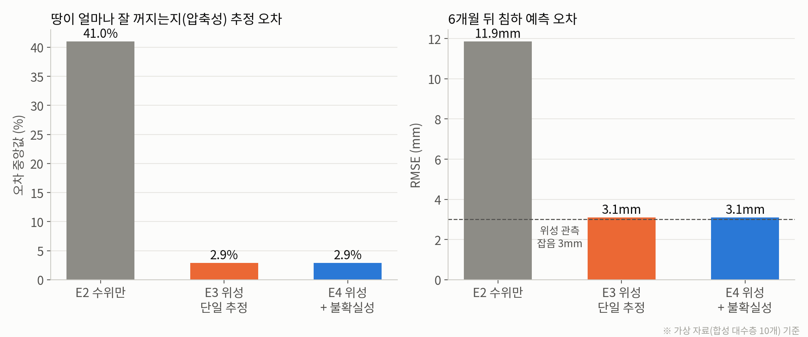
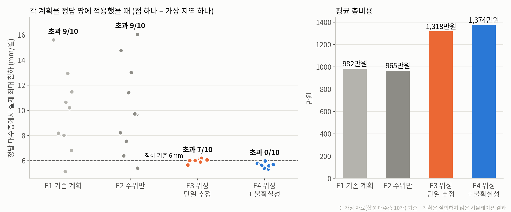

# AquaLimit (10/7)

> 가상 대수층 실험으로 위성 자료가 침하 예측 정확도를, 불확실성 반영이 계획 안전성을 높인다는 것을 확인

## 왜 가상 자료로 검증했나

**정답이 있어야 채점할 수 있다.**

- 실제 땅속이 얼마나 잘 꺼지는지는 아무도 정확히 모른다. 실제 자료로는 “결과가 그럴듯한지”까지만 볼 수 있다.
- 가상 땅은 정답을 우리가 정해 둔다. 그래서 “정답과 몇 % 다른지”를 정확히 잴 수 있다.
- 실제 자료에서 틀렸을 때 원인이 버그인지, 방법 문제인지, 땅이 복잡해서인지 구분하려면 가상 검증을 먼저 통과해야 한다.
- 지하수·지구물리 분야에서 새 역산 방법을 만들 때 거치는 표준 절차(synthetic test)이다. 

> “모의고사처럼, 답안지가 있는 문제로 먼저 저희 방법이 맞는지 확인했습니다. 실제 땅속은 답안지가 없기 때문입니다.”

## 실험 설계

- 6km × 6km 가상 지역. 우물 4개, 침하 관리지점 3개, 수위 관측정 4개.
- 색이 진할수록 잘 꺼지는 땅이다. 이 정답 지도를 우리가 정해 두고, 방법이 이걸 얼마나 맞히는지 본다.
- 일부러 어렵게 만들었다. 같은 구역 안에서도 땅의 성질이 위치마다 ±25% 다르다. 문제를 만든 방식과 푸는 방식이 똑같으면 너무 쉽게 맞기 때문이다.

| 가짜 관측 자료 | 내용 |
|---|---|
| 위성(InSAR) | Sentinel-1처럼 12일마다, 500m 화소 169개, 오차 ±3mm, 화소 10%는 관측 실패 |
| 관측정 | 월 1회 수위, 오차 ±5cm |
| 기간 | 2년. 앞 18개월로 학습하고 뒤 6개월로 채점 |

같은 실험을 가상 지역 10개에서 반복

## 비교한 네 가지 방식

| 방식 | 사용 자료 | 땅이 잘 꺼지는 정도 |
|---|---|---|
| E1 기존 계획 | 없음 | 고려 안 함. 우물 용량대로 나눠 뽑음 |
| E2 지상 관측만 | 우물 수위 | 문헌 평균값 하나로 가정 |
| E3 위성 + 단일 추정 | 수위 + 위성 침하 | 위성 화소마다 추정, 추정값 하나 사용 |
| E4 위성 + 불확실성 | 수위 + 위성 침하 | 추정을 30번 반복해 가능한 범위 전체 사용 |

- E2 vs E3: 위성이 왜 필요한가
- E3 vs E4: 불확실성을 왜 반영해야 하는가

계획 조건은 지난주 데모와 같다. 월 3만 톤 필요, 침하는 월 6mm 이하, 외부 용수 톤당 1,500원.

## 결과 ① 위성을 넣으면 땅속이 보인다

| | E2 수위만 | E3 위성 | E4 위성 + 불확실성 |
|---|---|---|---|
| 땅이 잘 꺼지는 정도 추정 오차 | 41.0% | 2.9% | 2.9% |
| 6개월 뒤 침하 예측 오차 | 11.9mm | 3.1mm | 3.1mm |

- 우물 수위만으로는 땅이 얼마나 꺼지기 쉬운지 알 수 없다. 우물은 몇 개 지점의 물 높이만 재기 때문이다.
- 위성은 지역 전체를 화소 단위로 보기 때문에 오차가 41%에서 2.9%로 줄었다.
- 예측 오차 3.1mm는 위성 관측 자체의 오차(3mm)와 거의 같다. 관측이 허락하는 만큼 최대로 맞힌 것이다.

> “지상 관측정만으로는 땅이 얼마나 꺼지기 쉬운지 알 수 없습니다. 위성은 땅 전체를 화소 단위로 보기 때문에 이걸 알 수 있습니다.”

## 결과 ② 불확실성을 반영해야 기준을 지킨다

각 방식이 세운 계획을 정답 땅에 적용해 실제로 몇 mm 꺼지는지 계산했다.

| | E1 기존 | E2 수위만 | E3 위성 단일 | E4 위성 + 불확실성 |
|---|---|---|---|---|
| 침하 기준 초과 (10곳 중) | 9 | 9 | 7 | **0** |
| 평균 총비용 | 982만원 | 965만원 | 1,318만원 | 1,374만원 |

- E1·E2는 땅이 얼마나 꺼지는지 몰라서 평균 10mm 이상, 최대 16mm까지 꺼졌다.
- E3는 기준선(6mm)에 딱 붙어 있다. 추정값 하나를 믿고 기준에 정확히 맞춰 계획하기 때문에, 추정이 조금만 낮아도 넘는다. 넘은 양은 평균 0.07mm로 작지만 여유가 전혀 없다.
- E4는 가능한 범위 전체에서 기준을 지키도록 계획해서 10곳 모두 기준 안이다. 비용은 E3보다 약 4% 높다.

> “추정값 하나만 믿고 기준선에 딱 맞춰 계획하면 추정이 조금만 틀려도 기준을 넘습니다. 불확실성 범위 전체에서 기준을 지키도록 계획하면, 비용 4%로 초과를 막을 수 있습니다.”

※ 이 결과는 계획을 실제로 실행한 것이 아니라 정답 땅에서 계산한 시뮬레이션 결과다.

## 불가능하면 불가능하다고 알려준다

| 입력 | 결과 |
|---|---|
| 수요 4만 톤, 침하 기준 1mm | 실행 불가 — 침하 기준을 지키면서 수요를 채울 수 없음. 추가 용수 확보 필요 |
| 수요 6만 톤, 침하 기준 6mm | 실행 불가 — 우물 용량과 외부 구매 한도를 모두 써도 부족 |
| 수요 3만 톤, 침하 기준 6mm | 계획 산출 |

- 불가능한 이유가 침하 기준 때문인지 용량 부족 때문인지 구분해서 알려준다.

> “답이 없는 상황에서 답이 없다고 말하는 것도 의사결정 도구의 기능입니다.”

## 구현

`가상 땅 생성 → 가짜 위성·관측정 자료 → 역산(땅속 성질 추정) → 침하 관계 계산 → 최적 계획 → 정답 땅에서 채점`

| 기술 | 사용한 곳 |
|---|---|
| Python | 전체 |
| NumPy | 가상 땅, 수위·침하 계산, 10회 반복 실험 |
| SciPy | Theis 공식(지하수 수위 계산), 역산(최소제곱), 최적 계획(선형계획) |
| Matplotlib | 발표 그림 |

- 역산: 관측과 모델 계산의 차이가 가장 작아지는 땅속 성질을 찾는다.
- 불확실성: 관측값에 오차를 새로 섞어 30번 다시 추정한다(RML 방식). 그러면 “이 정도 관측 오차면 답이 이 범위에서 흔들린다”는 분포가 나온다.
- 지난주 데모의 최적화 코드를 그대로 재사용했다. 침하 관계만 가정값에서 계산값으로 바뀌었다.
- 코드: `synthetic/`, 상세 결과: `synthetic/results/RESULTS.md`

## 한계 — 아직 단순화한 부분

| 한계 | 다음 단계 |
|---|---|
| 지하수 계산이 교과서 공식(Theis 해)이다. 지층 여러 겹, 한번 꺼지면 회복되지 않는 침하는 빠져 있다 | MODFLOW 6(USGS 지하수 시뮬레이터) + 침하 패키지로 교체 |
| 위성이 수직 침하를 깨끗하게 본다고 가정했다. 실제 위성은 비스듬히 보고 대기 오차가 있다 | 실제 InSAR 자료로 처리 과정 추가 |
| 불확실성 범위가 정답을 포함한 비율이 82%로, 목표 90%보다 낮다. 불확실성을 조금 작게 잡고 있다 | 범위 계산 방법 보완 |
| 모든 수치가 가상 자료 결과다 | 검증 지역 확정 후 실제 자료로 검증 |

## 다음 주 계획

| 작업 | 내용 | 결과물 |
|---|---|---|
| 물리모델 교체 | 침하 관계 계산을 MODFLOW 6 + 침하 패키지로 교체 | 물리모델 기반 E1~E4 결과 |
| 검증 지역 확정 | 위성·수위·지질 자료 충족표로 지역 결정 | 검증 지역 확정 |
| 실제 InSAR 확보 | 공개 처리 자료 확인 후 불러오기 | 실제 지역 침하 지도 |
| 불확실성 보완 | 90% 범위가 정답을 90% 포함하도록 보정 | 개선된 앙상블 |

